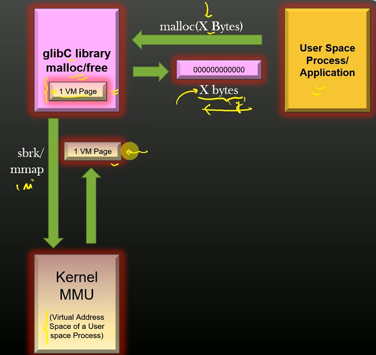
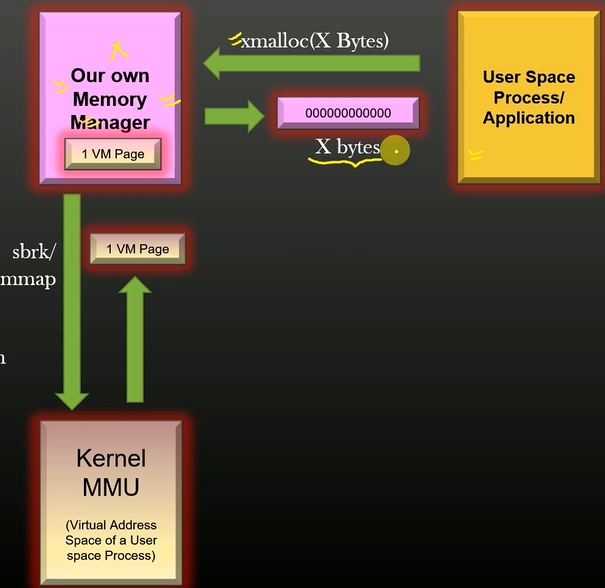
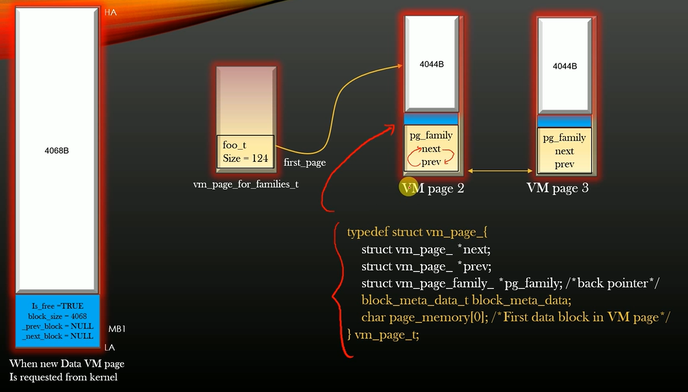
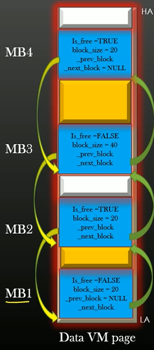
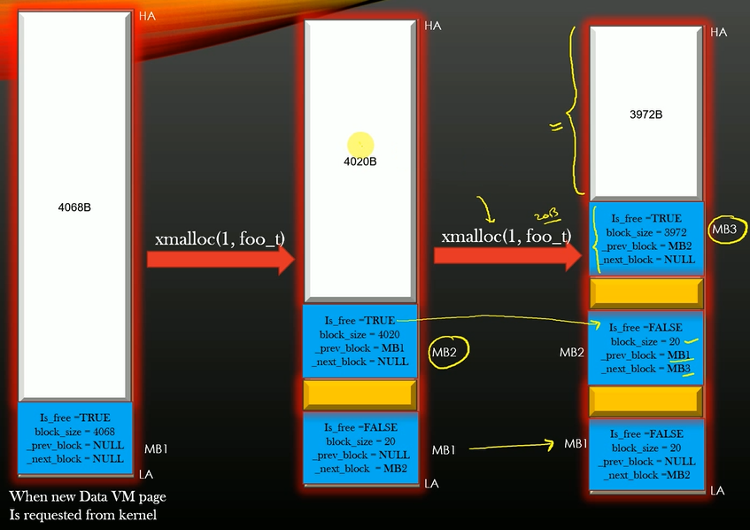
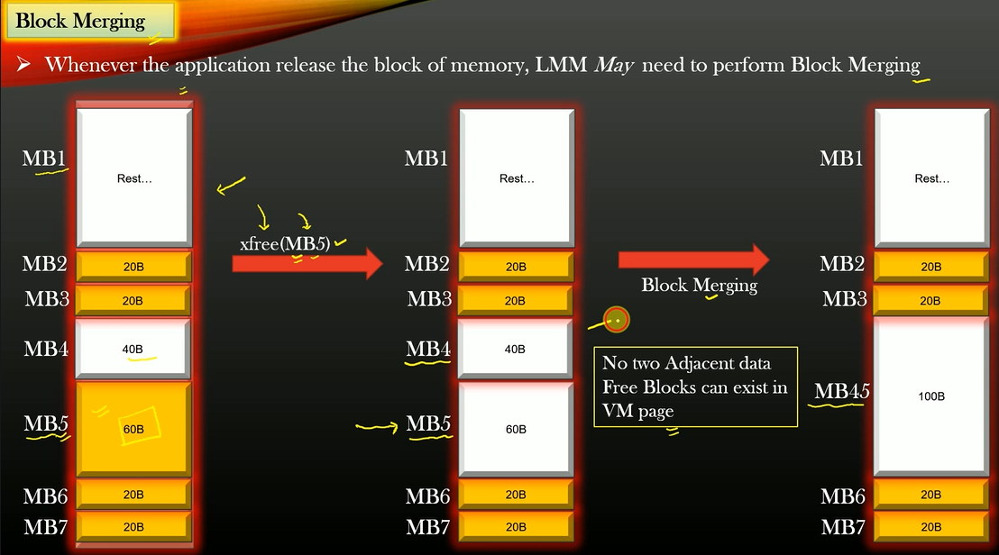
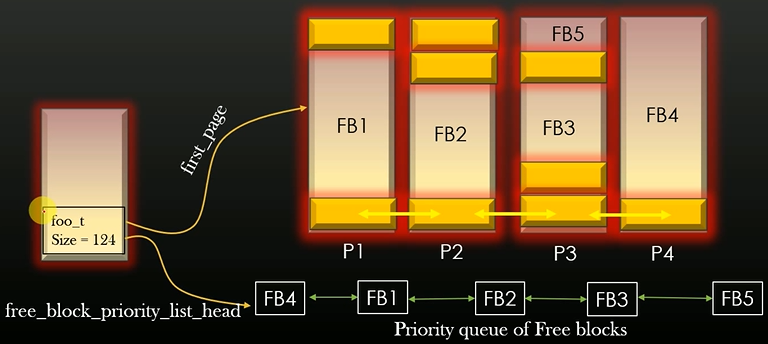

# Heap-IE — Custom Linux Memory Manager

A userspace memory allocator that replaces glibc's `malloc`/`free` with a custom page-based memory management scheme, addressing **heap fragmentation** through block splitting and merging with priority-queue-based free block tracking.

## How It Works

### Architecture



The standard glibc memory manager sits between your application and the kernel. Heap-IE replaces it with a custom allocator:



### Memory Layout

VM pages are requested from the kernel via `mmap()` and internally managed as linked data structures:



Each VM page is divided into **meta blocks** (28 bytes of bookkeeping) and **data blocks** (actual user memory):



### Allocation (Block Splitting)

When `xcalloc()` is called, the allocator finds the best free block and splits it:




### Deallocation (Block Merging)

When `xfree()` is called, adjacent free blocks are merged to reduce fragmentation:



### Free Block Tracking

Free blocks are maintained in a priority list (worst-fit policy) for O(n) allocation:



### User API


## Build & Run

### Prerequisites

- GCC or Clang
- Linux (uses `mmap`/`munmap` syscalls)
- `make` (optional, or compile directly)

### Compile

```bash
cd proj/
gcc -g -c mm.c -o mm.o
gcc -g -c gluethread/glthread.c -o glthread.o
gcc -g -c testapp.c -o testapp.o
gcc mm.o glthread.o testapp.o -o exe
```

### Run

```bash
./exe
```

### Example Usage (in code)

```c
#include "uapi_mm.h"

typedef struct emp_ {
    char name[32];
    uint32_t emp_id;
} emp_t;

int main() {
    mm_init();
    MM_REG_STRUCT(emp_t);

    emp_t *e = XCALLOC(1, emp_t);   // allocate 1 emp_t
    XFREE(e);                        // free it
}
```

## Supported Platforms

| Platform | Status |
|---|---|
| Linux x86_64 | Supported |
| Linux aarch64 | Supported |
| macOS / Windows | Not supported (requires `mmap`/`munmap`) |

## License

Unlicensed / Educational
