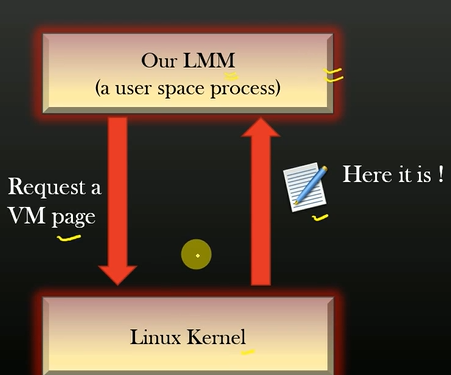

## Functionality 1: Virtual Memory Page Allocation/De-allocation

- Size of VM page is ~4KB to 8KB on most modern systems, we usually use library calls like malloc/calloc to allocate dynamic memory in our programs. \



- In linux there are two primary sets of syscalls usesd to allocate/deallocate VM blocks from the OS by running process: \


-  All the standard glibC memory management functions  like: malloc, free, realloc, calloc etc invoke one of the above syscalls. \

- For this custom memory allocator **mmap/munmap()** are going to be used for memory allocation for a process instead of **sbrk()**. \

**NOTE:** mmap() is both: it is a system call implemented by the operating system kernel and a libc function that acts as a wrapper to that system call. It uses mmap_pgoff() syscall internally. \


### mmap() System call


- In our **Linux Memory Manager(LMM)** -> a usersapce process, it is assigned a complete VM page on request, whereupon the LMM can further split the assigned page to meet the memory requirements. \

- VM pages allocated by mmap() need not be contiguous in Heap memory segment of the process as opposed to what is expected from *sbrk().* \

-  **Heap Memory Segment** is a data structure maintained by kernel for every process, to keep track of theirVM pages used by each process (using the LMM). \

- The cutom LMM acquires and releases memory from kernel in **VM PAGE_SIZE** granuality. \


### API signature for allocation and de-allocation

- For requesting x-'units' of contiguous pagres from kernel: \

```
/*
    @params:
        int units: number of contiguous pages requested
    @return:
        (void *) starting address of the first allocated page. 
*/

static void*
mm_get_new_vm_page_from_kernel (int units); 
```


- To Return x-'units' of allocated contiguous pages to the kernel: \

```
/*
    @params:
        int units: number/multiple of contiguous unit of pages to be returned(stating from the first allocated page)

        void *vm_page: address of the first page from where memory has to be returned in contiguous multiple chunks

    @return:
        (void) --> only prints error message in console if un-mapping fails
*/

static void*
mm_return_vm_page_to_kernel (void *vm_page, int units); 
```