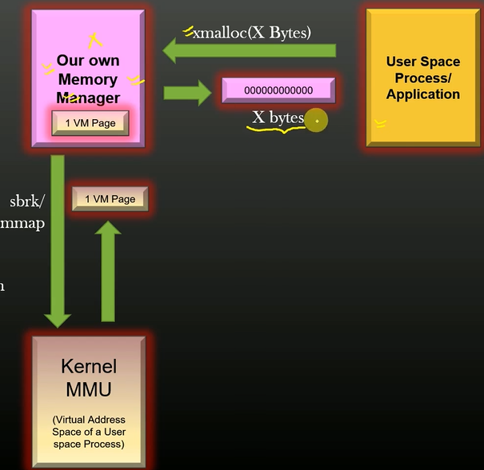
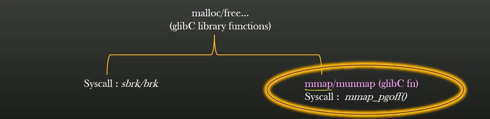
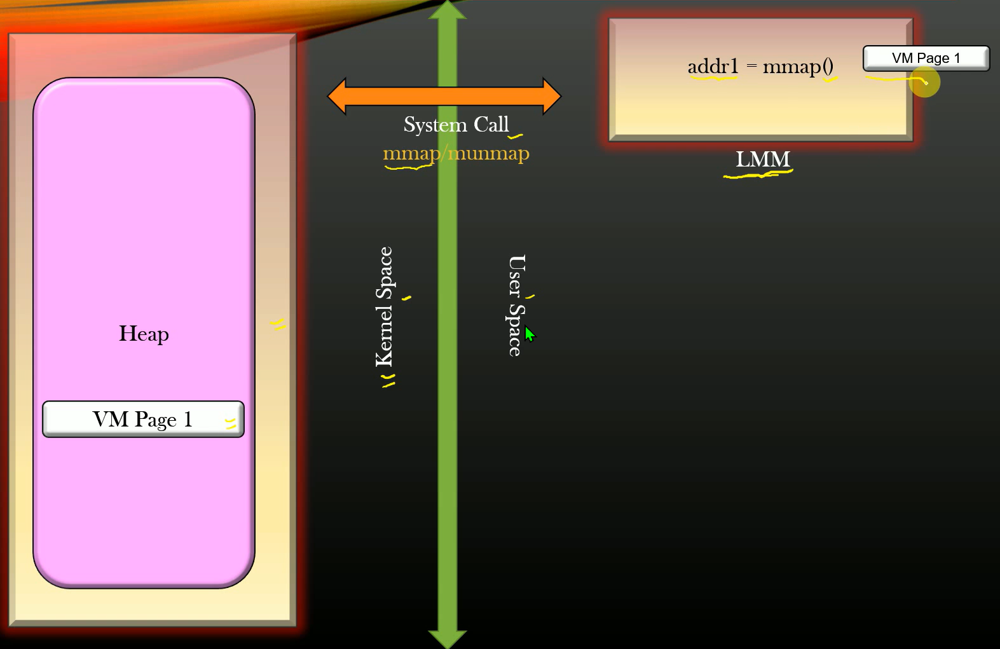
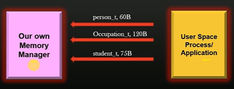
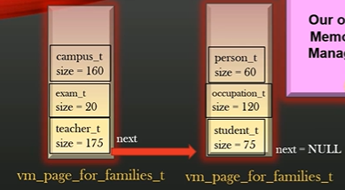

## Project Design and Architecture


- Memory allocation/de-allocation between process and glibC can happen
for any arbitrary size. \

- Memory allocation and de-allocation b/w glibC and kernel MMU happens only in units of system's configured Page Size. \

- As Syscalls like sbrk/mmap are expensive, glibC caches the VM page allocated by the kernel MMU and allocates small chunks out of it to the 
userspace process on need-basis. \

- When glibC detecs that the userspace process has freed all the memory in a given VM page, glibC returns the page back to the kernel MMU using syscalls like sbrk/munmap. \

- The aim is to replace this glibC memory manager with a custom memory manager, as shown below: \



## Functionality 1: Virtual Memory Page Allocation/De-allocation

- Size of VM page is ~4KB to 8KB on most modern systems, we usually use library calls like malloc/calloc to allocate dynamic memory in our programs. \


- In linux there are two primary sets of syscalls usesd to allocate/deallocate VM blocks from the OS by running process: \



-  All the standard glibC memory management functions  like: malloc, free, realloc, calloc etc invoke one of the above syscalls. \

- For this custom memory allocator **mmap/munmap()** are going to be used for memory allocation for a process instead of **sbrk()**. \

**NOTE:** mmap() is both: it is a system call implemented by the operating system kernel and a libc function that acts as a wrapper to that system call. It uses mmap_pgoff() syscall internally. \


### mmap() System call



- In our **Linux Memory Manager(LMM)** -> a usersapce process, it is assigned a complete VM page on request, whereupon the LMM can further split the assigned page to meet the memory requirements. \

- VM pages allocated by mmap() need not be contiguous in Heap memory segment of the process as opposed to what is expected from *sbrk().* \

-  **Heap Memory Segment** is a data structure maintained by kernel for every process, to keep track of theirVM pages used by each process (using the LMM). \

- The cutom LMM acquires and releases memory from kernel in **VM PAGE_SIZE** granuality. \


### API signature for allocation and de-allocation

- For requesting x-'units' of contiguous pagres from kernel: \

```
/*
    @params:
        int units: number of contiguous pages requested
    @return:
        (void *) starting address of the first allocated page. 
*/

static void*
mm_get_new_vm_page_from_kernel (int units); 
```


- To Return x-'units' of allocated contiguous pages to the kernel: \

```
/*
    @params:
        int units: number/multiple of contiguous unit of pages to be returned(stating from the first allocated page)

        void *vm_page: address of the first page from where memory has to be returned in contiguous multiple chunks

    @return:
        (void) --> only prints error message in console if un-mapping fails
*/

static void*
mm_return_vm_page_to_kernel (void *vm_page, int units); 
```

## Functionality 2: Page Family Registration

- During initilization the User Space application tells the LMM (on which relying for memory allocation/de-allocation), about the structures its using. \

- Thhis step is essential for LMM as it needs to know the size of each structure, in order to allocate appropriate amount of memory when userspace application requests for it. \



- LMM stores application structure info i.e. \ 

```
{
    <Name of the struct>,
    <size of struct>
}
```

**to store these info LMM uses the VM pagesrequested from kernel specifically to store registration info.** \


### Page Family Data Structures

1) LMM reuests VM page(s) from the kernel to store registration info, consisting of : \

```
struct vm_page_family_t {
    <Structure name>,
    <Structure size>
}
```

2) VM pages stores the page families, starting from bottom to top, in a contiguous fashion. \

3) VM pages used to store page families are called **"VM pages for Families"** (vm_pages_for_families_t) \

4) If LMM needs more VM pages to store more application's page family, it can always request for more VM pages from the kernel.

5) Multiple VM pages for families are linked together as a linked list, and is **accessible through the latest one - the head.** \




```
/*
    [[ vm_page_families_t ]]
    (each node represents one 
    entire VM page allocated 
    for page family registration)
            |
            |
      <encapsulates>
            |
            |
            V
    [[ vm_page_family_t]]
     (contains all the struct name and size info indexed into array, once it fills up the current VM page, new VM page needs to be requested by LMM for info registration of leftover structs in the application)
*/


typedef struct vm_page_family_ {

    char struct_name [MM_MAX_STRUCT NAME];
    uint32_t struct_size;

} vm_page_family_t;


typedef struct vm_page_families_ {

    struct vm_page_families_* next;
    vm_page_family_t vm_page_family[0];

} vm_page_families_t;

```

### Page Family Instantiati on

-  These family of APIs deal with how application process is going to report page family info to the LMM? \

Using following API Userspace application can perform family registration with LMM:    \

```
mm_instantiate_new_page_family ("person_t", sizeof(person_t));
```

### Page family instantiation Algorithm

```

/* Global variable pointing to the head */
static vm_page_for_families_t* first_vm_page_for_families = NULL;


/* ALGORITHM: */

void mm_instantiate_new_page_family (char* struct_name, uint32_t struct_size) {

    1. Create a new "vm_page_family_t" from args.
    
    2. If LMM has not taken its first "vm_page_for_families_t" VM page,
       allocate one from the kernel, update "first_vm_page_for_families" global pointer.
    
    3. check if new "vm_page_family_t" can be accomodated into "first_vm_page_for_families" VM page :

        3a. YES -> then insert new "vm_page_family_t" entry into
            "first_vm_page_for families" [END]
        3b. NO -> allocate new VM page from the kernel, update linked list
            and update "first_vm_page_fro_families" ptr to point to the most
            recent allicated VM page.
    
    4. Insert new "vm_page_family_t" into current "first_vm_page_for_families" 
        VM page and link the older "first_vm_page_for_families" to the current one using the *next pointer.
}

```

### Exposing public LMM APIs

![uapi_mm.h]](assets/uapi.png)

- **uapi_mm.h** will provide publicly exposed structs and API of the custom LMM through header file. \
- uapi_mm.h is an interface betweenLMM lib and application. It provides public APIs like mm_init() and macros like MM_REG_STRUCT() etc. \